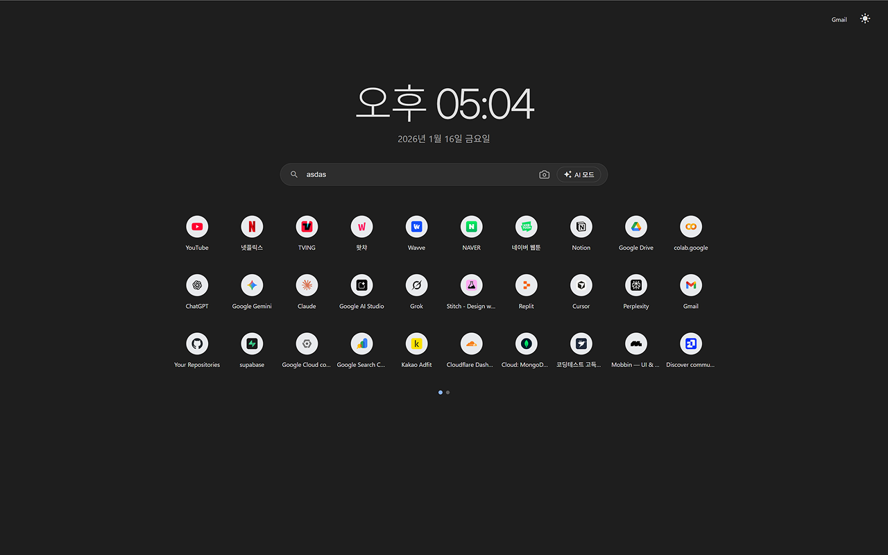
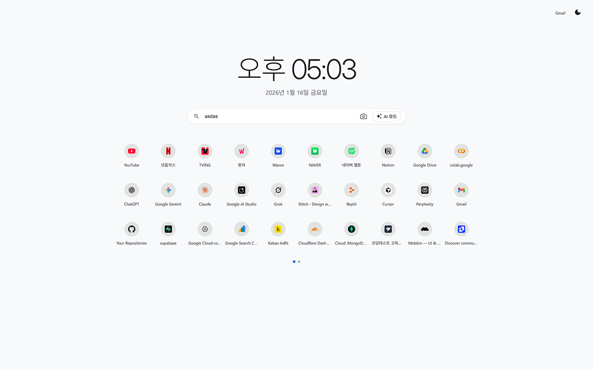

# More Shortcuts New Tab

<p align="center">
  
</p>

<p align="center">
  <strong>Chrome's 10-shortcut limit? Not anymore.</strong><br>
  A beautiful new tab page with up to 30 shortcuts, drag & drop reordering, and AI search integration.
</p>

<p align="center">
  <a href="#features">Features</a> •
  <a href="#installation">Installation</a> •
  <a href="#usage">Usage</a> •
  <a href="#screenshots">Screenshots</a> •
  <a href="#contributing">Contributing</a> •
  <a href="#license">License</a>
</p>

---

## Features

- **30 Shortcuts** — Overcome Chrome's default 10-shortcut limit
- **Drag & Drop** — Reorder shortcuts with smooth FLIP animations
- **Multi-Page Support** — Organize shortcuts across multiple pages with pagination
- **Dark / Light Theme** — Toggle between themes with one click
- **Google Search Integration** — Search Google directly from the new tab
- **Image Search** — Quick access to Google Image Search
- **AI Mode** — One-click access to Google AI Overview search
- **Auto Title Fetch** — Automatically fetches page titles when adding shortcuts
- **Top Sites Sync** — Initializes with your most visited sites on first use
- **Multi-language** — Supports Korean and English based on browser locale
- **Digital Clock** — Beautiful clock with date display
- **Keyboard Navigation** — Navigate pages with arrow keys
- **Privacy First** — All data stored locally via Chrome Storage API

## Installation

### From Chrome Web Store
> Coming soon!

### Manual Installation (Developer Mode)

1. **Download or Clone** this repository:
   ```bash
   git clone https://github.com/chanyoung/More-Shortcuts-New-Tab.git
   ```

2. Open Chrome and navigate to `chrome://extensions/`

3. Enable **Developer mode** (toggle in top-right corner)

4. Click **Load unpacked** and select the project folder

5. Open a new tab to see your enhanced new tab page!

## Usage

### Adding Shortcuts
- Click the **+** button to add a new shortcut
- Enter the URL — the title will be auto-fetched
- Or manually enter both name and URL

### Managing Shortcuts
- **Hover** over a shortcut to see the options menu (⋮)
- **Edit** — Modify name or URL
- **Delete** — Remove the shortcut
- **Drag & Drop** — Hold and drag to reorder

### Navigation
- Use **left/right arrow keys** to switch between pages
- Click on **pagination dots** to jump to a specific page

### Search
- Type in the search bar and press **Enter** for Google Search
- Click the **camera icon** for Image Search
- Click **AI Mode** button for Google AI Overview

### Theme
- Click the **moon/sun icon** in the top-right corner to toggle dark/light theme

## Screenshots

| Dark Theme | Light Theme |
|:----------:|:-----------:|
|  |  |

## Technical Details

- **Manifest Version**: 3 (latest Chrome extension standard)
- **Permissions**:
  - `storage` — Save shortcuts and preferences
  - `topSites` — Access most visited sites for initial setup
  - `favicon` — Display website favicons
- **Storage**: Chrome Sync Storage (syncs across devices when signed in)
- **No External Dependencies**: All fonts (Inter, Material Icons) are bundled locally

## File Structure

```
More-Shortcuts-New-Tab/
├── manifest.json              # Extension configuration
├── src/
│   ├── newtab.html            # Main HTML structure
│   ├── script.js              # Core functionality
│   ├── styles.css             # Styling with CSS variables
│   └── fonts/
│       ├── Inter-VariableFont.ttf
│       └── MaterialIcons-Regular.woff2
├── assets/
│   ├── icons/
│   │   └── icon128.png        # Extension icon
│   └── screenshots/           # Store screenshots
├── LICENSE
└── README.md
```

## Contributing

Contributions are welcome! Feel free to:

1. Fork this repository
2. Create a feature branch (`git checkout -b feature/amazing-feature`)
3. Commit your changes (`git commit -m 'Add amazing feature'`)
4. Push to the branch (`git push origin feature/amazing-feature`)
5. Open a Pull Request

## Changelog

### v1.0.0 (2025-01-16)
- Initial release
- 30 shortcuts with drag & drop reordering
- Dark/Light theme support
- Google Search, Image Search, AI Mode integration
- Multi-page pagination
- Auto title fetching
- Korean/English localization

## License

This project is licensed under the MIT License — see the [LICENSE](LICENSE) file for details.

---

<p align="center">
  Made with ❤️ for a better browsing experience
</p>
