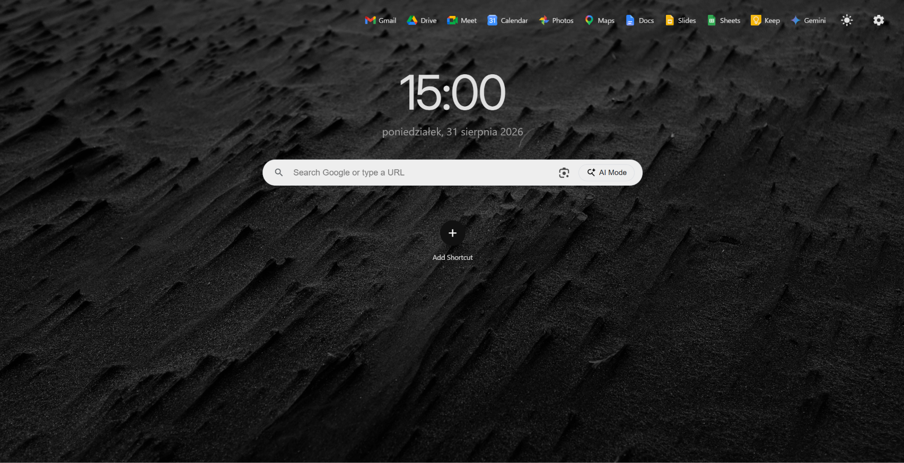
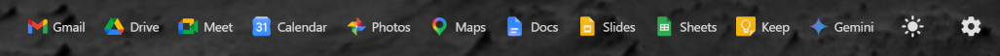
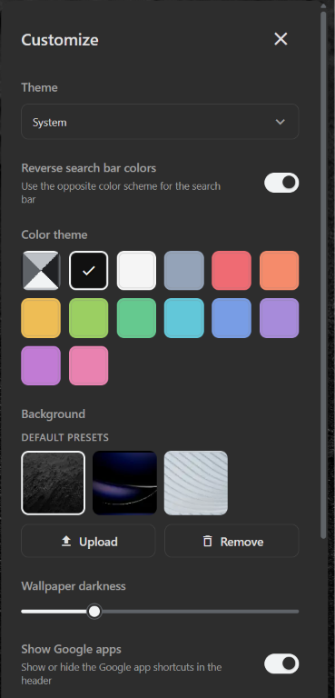
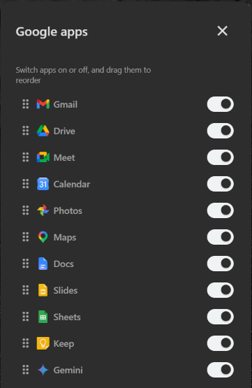
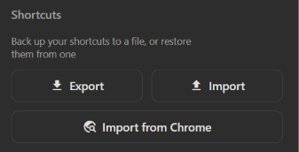
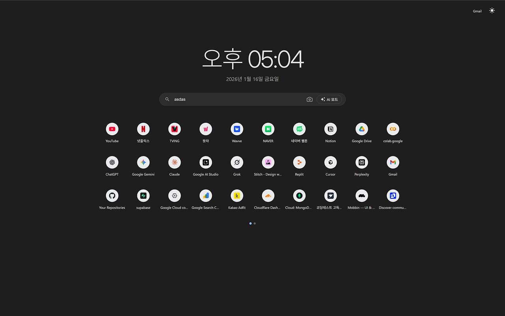
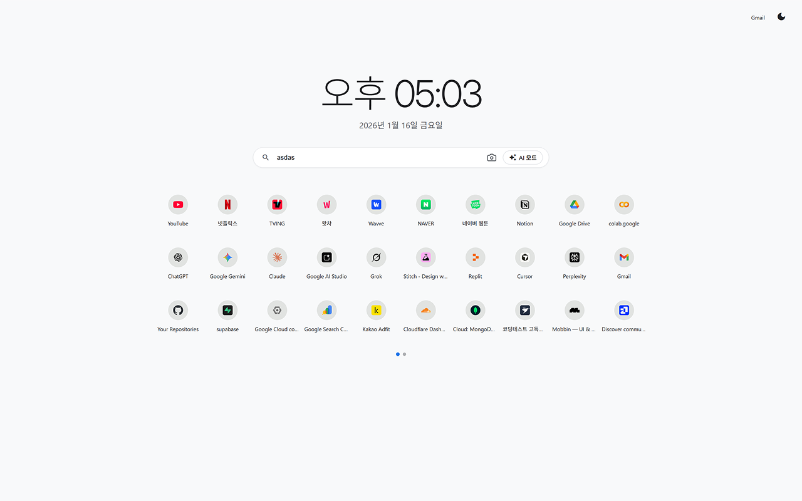
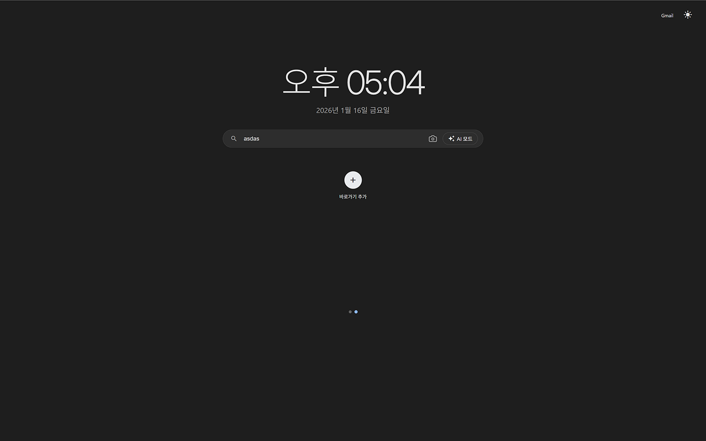
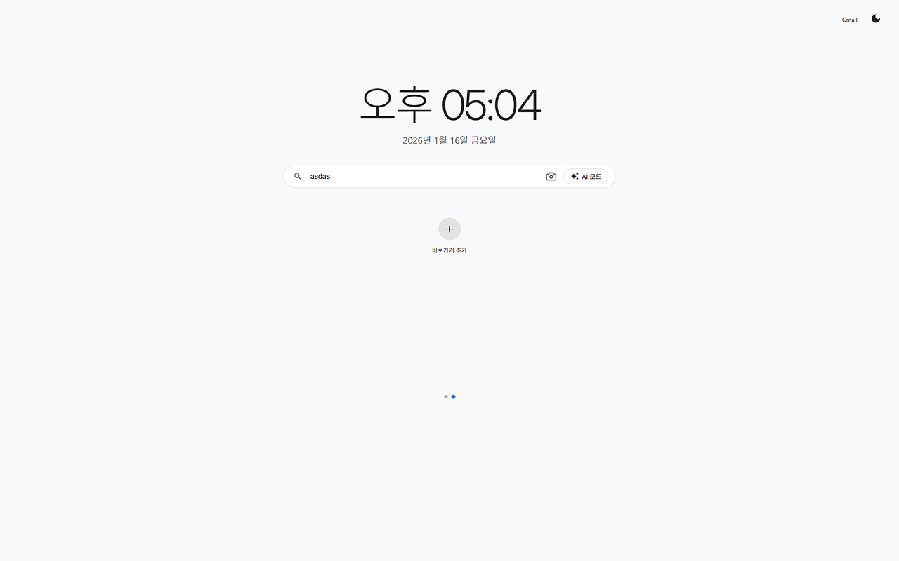

# More Shortcuts New Tab

<p align="center">
  <a href="https://chromewebstore.google.com/detail/more-shortcuts-new-tab/kogaidjbbpniklkafmfbgmihfdmkjkaf?hl=en-US"></a>
  <a href="https://chromewebstore.google.com/detail/more-shortcuts-new-tab/kogaidjbbpniklkafmfbgmihfdmkjkaf?hl=en-US"></a>
  
  
  
  
  
</p>

<p align="center">
  <picture>
    <source media="(prefers-color-scheme: dark)" srcset="assets/icons/icon128-white.png">
    
  </picture>
</p>

<p align="center">
  <strong>Chrome's 10-shortcut limit? Not anymore.</strong><br>
  A beautiful new tab page with up to 30 shortcuts, drag & drop reordering, and AI search integration.
</p>

<p align="center">
  <a href="#features">Features</a> •
  <a href="#installation">Installation</a> •
  <a href="#usage">Usage</a> •
  <a href="#screenshots">Screenshots</a> •
  <a href="#contributing">Contributing</a> •
  <a href="#license">License</a>
</p>

---

## Features

### Shortcuts
- **30 Shortcuts**: overcome Chrome's default 10-shortcut limit
- **Drag & Drop**: reorder shortcuts with smooth FLIP animations
- **Multi-Page Support**: organize shortcuts across multiple pages with pagination
- **Auto Title Fetch**: automatically fetches page titles when adding shortcuts
- **Export / Import**: back up your shortcuts to a file, or restore them on another device
- **Import from Chrome**: pull shortcuts straight from Chrome's own New Tab page by selecting its `Preferences` file, with a preview to pick which ones to add

### Search
- **Google Search Integration**: search Google directly from the new tab, with live suggestions
- **Image Search**: quick access to Google Lens / Image Search
- **AI Mode**: one-click access to Google AI Overview search

### Customization
- **Dark / Light / System Theme**: toggle instantly or follow your OS setting
- **Accent Colors**: personalize the search bar and UI with a palette of color themes
- **Wallpapers**: set a custom background image or pick from built-in presets, with adjustable darkness
- **Google Apps Bar**: show, hide, and reorder quick links to Gmail, Drive, Meet, Calendar, Photos, Maps, Docs, Slides, Sheets, Keep, and Gemini

### Everyday use
- **Digital Clock**: clean clock with date display
- **Keyboard Navigation**: switch pages with arrow keys, jump to search with `/`
- **Multi-language**: automatically matches Chrome's display language (English, Korean, Russian, Japanese, Chinese, Spanish, French, German, Portuguese, Vietnamese, Indonesian), with English as fallback
- **Privacy First**: all data stored locally via the Chrome Storage API, nothing sent to a third-party server

## Installation

### From Chrome Web Store
Install directly from the [Chrome Web Store](https://chromewebstore.google.com/detail/more-shortcuts-new-tab/kogaidjbbpniklkafmfbgmihfdmkjkaf?hl=en-US).

### Manual Installation (Developer Mode)

1. **Download or Clone** this repository:
   ```bash
   git clone https://github.com/FalconDevX/More-Shortcuts-New-Tab.git
   ```

2. Open Chrome and navigate to `chrome://extensions/`

3. Enable **Developer mode** (toggle in top-right corner)

4. Click **Load unpacked** and select the project folder

5. Open a new tab to see your enhanced new tab page!

## Usage

### Adding Shortcuts
- Click the **+** button to add a new shortcut
- Enter the URL, the title will be auto-fetched
- Or manually enter both name and URL

### Managing Shortcuts
- **Hover** over a shortcut to see the options menu (⋮)
- **Edit**: modify name or URL
- **Delete**: remove the shortcut
- **Drag & Drop**: hold and drag to reorder

### Navigation
- Use **left/right arrow keys** to switch between pages
- Click on **pagination dots** to jump to a specific page

### Search
- Type in the search bar and press **Enter** for Google Search
- Click the **camera icon** for Image Search
- Click **AI Mode** button for Google AI Overview

### Customize Panel
- Click the **customize icon** in the top-right corner to open the panel
- Switch **theme** (system, light, or dark) and pick an **accent color**
- Upload a **wallpaper** or choose a preset, and adjust its darkness
- Show, hide, and reorder the **Google apps bar**
- **Export** your shortcuts to a file, or **import** a previous backup
- **Import from Chrome**: select Chrome's `Preferences` file (find it via `chrome://version` → "Profile Path") to pull in your existing Chrome New Tab shortcuts, with a checklist to choose which ones to add

## Screenshots

<p align="center">
  <br>
  <sub><strong>New tab page</strong></sub>
</p>

<p align="center">
  <br>
  <sub><strong>Google apps bar</strong></sub>
</p>

<table>
  <tr>
    <td align="center">
      <br>
      <sub><strong>Customize panel</strong></sub>
    </td>
    <td align="center">
      <br>
      <sub><strong>Choose & reorder Google apps</strong></sub>
    </td>
  </tr>
  <tr>
    <td align="center" colspan="2">
      <br>
      <sub><strong>Import shortcuts from Chrome's own New Tab page</strong></sub>
    </td>
  </tr>
  <tr>
    <td align="center">
      <br>
      <sub><strong>Dark theme</strong></sub>
    </td>
    <td align="center">
      <br>
      <sub><strong>Light theme</strong></sub>
    </td>
  </tr>
  <tr>
    <td align="center">
      <br>
      <sub><strong>Dark theme, empty state</strong></sub>
    </td>
    <td align="center">
      <br>
      <sub><strong>Light theme, empty state</strong></sub>
    </td>
  </tr>
</table>

## Technical Details

- **Manifest Version**: 3 (latest Chrome extension standard)
- **Permissions**:
  - `storage` / `unlimitedStorage`: save shortcuts, wallpapers, and preferences
  - `favicon`: display website favicons
  - `search`: run searches through Chrome's default search engine
  - `host_permissions` (`<all_urls>`): fetch page titles and favicons for the sites you add
- **Storage**: shortcuts, theme, accent color, wallpaper darkness, and Google Apps bar settings sync across devices via Chrome Sync Storage when signed in; the wallpaper image itself is too large for sync's quota and stays local to each browser
- **No External Dependencies**: all fonts (Inter, Material Icons) are bundled locally

## File Structure

```
More-Shortcuts-New-Tab/
├── manifest.json              # Extension configuration
├── src/
│   ├── newtab.html            # Main HTML structure
│   ├── js/
│   │   ├── main.js            # Entry point, localization, global listeners
│   │   ├── prefs.js           # Synced preferences (chrome.storage.sync + local mirror)
│   │   ├── theme.js           # Light/dark/system theme handling
│   │   ├── customize.js       # Customize panel, wallpaper, Google apps bar
│   │   ├── shortcuts.js       # Grid rendering, pagination
│   │   ├── storage.js         # Shortcuts persistence (chrome.storage.sync)
│   │   ├── favicons.js        # Favicon fetching, caching, fallbacks
│   │   ├── dragdrop.js        # Drag-and-drop reordering
│   │   ├── search.js          # Search bar and suggestions
│   │   ├── clock.js           # Clock and date display
│   │   ├── modal.js           # Add/edit shortcut modal
│   │   └── chromeImport.js    # Import shortcuts from Chrome's Preferences file
│   ├── styles.css             # Styling with CSS variables
│   └── fonts/
│       ├── Inter-VariableFont.ttf
│       └── MaterialIcons-Regular.woff2
├── assets/
│   ├── icons/                 # Extension icons and Google app logos
│   ├── screenshots/           # Store screenshots
│   └── wallpapers/            # Built-in wallpaper presets
├── LICENSE
└── README.md
```

## Contributing

Contributions are welcome! Feel free to:

1. Fork this repository
2. Create a feature branch (`git checkout -b feature/amazing-feature`)
3. Commit your changes (`git commit -m 'Add amazing feature'`)
4. Push to the branch (`git push origin feature/amazing-feature`)
5. Open a Pull Request

## License

This project is licensed under the MIT License, see the [LICENSE](LICENSE) file for details.

---

<p align="center">
  Made with ❤️ for a better browsing experience
</p>
